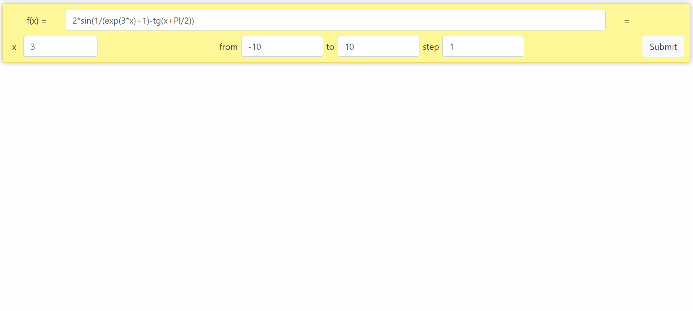

# Inline calculator

This is a practical task #1 for computational theory and computer technologies course.<br />
**Tasks:**<br />
1. Program should parse a mathematical expression f(x), given in the linear form.
2. Main types of errors, if any, should be indicated (mismatch of parentheses, spelling errors, incorrect function names
, etc.).
3. Program should evaluate the function y = f(x) on a given interval [x1,..,x2].
4. Program should plot a graph of a function y = f(x) on a given interval [x1,..,x2].
<br/>

**Implemented operations, functions and constants:** sin, cos, tg, exp, abs, pow, sqrt, E, PI<br/>
Shunting-yard algorithm used for parsing; implementation can be found in the ```function.py```. Basic unit tests for all 
implemented operations can be found in the *tests* folder.

## Demo


